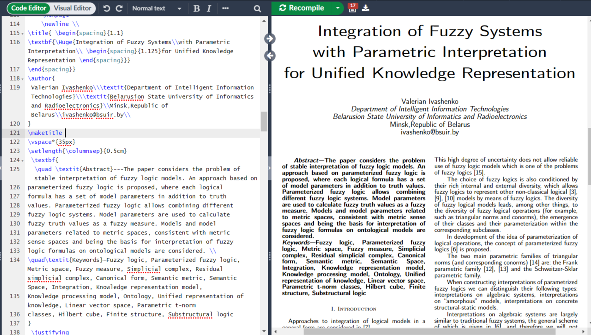

# Лабараторная работа №1

### Цель:
Научиться верстать при помощью LaTeX
### Задание:
Сверстать три страницы научной статьи с использованием системы верстки текстов TeX.
[На странице](https://proc.ostis.net/proc/Proceedings%20OSTIS-2024.pdf) необходимо взять доклад, соответствующий варианту индивидуального задания.Доклад представлен в форме статьи в формате *.pdf.
Для написания формального текста предлагается воспользоваться пакетом макросов “scn-latex”. Для оформления списка источников использовать `\bibliography` команду
### Прилагаемые файлы/ссылки:
* [1лр.pdf](https://github.com/ksy-sky/kseniya_ganetskaya/blob/main/1лр.pdf) - готовый pdf-файл с вёрсткой
* [Гайд](https://www.overleaf.com/learn/latex/Learn_LaTeX_in_30_minutes) от создателей overleaf(LaTeX за 30 минут)

# Лабараторная работа №3
### Цель:
Ознакомится с системой управлениями версиями Git и веб-сервисом GitHub
### Задание:
Получить практические навыки работы в консоли, использования консольных команд.
[Задания по гиту](https://docs.google.com/document/d/1pkqZWOlte5j6PuPpz7w03tPkw64ctuUwELoI-qctYVQ/edit?tab=t.0)
Для сдачи работы необходимо выполнить все задания и составить отчёт с тем, как эти задания выполнялись
### Основные команды Git:
* `git init` - инициализация нового репозитория
* ` git status` - проверка файлов на индексирование и наличие его в репозитории
* `git log` - посмотреть протокол коммитов
* ` git commit` - делает для проекта снимок текущего состояния изменений, добавленных в раздел проиндексированных файлов
### Примеры GitHub-организаций, которые содержат список различных репозиториев:
*[OSTIS AI](https://github.com/ostis-ai). Организация фокусируется разработкой проекта Технологии OSTIS.
*[OSTIS Applications](https://github.com/ostis-apps). Организация фокусируется на хранении и развитии проектов, разработанных на основе Технологии OSTIS.
### Вывод:
С помощью Git можно фиксировать изменения в проекте на локальном уровне и при необходимости возвращаться к предыдущим версиям. Также можно создать резервную копию на удалённом сервере, поддерживающем Git, и делиться результатами с другими пользователями.
